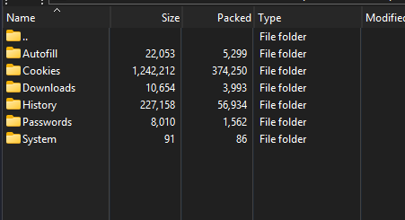

🛡️ RENOA Infostealer

Educational Windows infostealer project for malware analysis, reverse engineering, and security research.

RENOA is a Windows-based security research project created to help security researchers, developers, and students understand how infostealer malware operates, how browser data may be targeted, and how defensive detection techniques can be developed.

⚠️ Disclaimer

RENOA is intended strictly for educational, research, malware-analysis, and authorized security-testing purposes.

You may edit, modify, improve, extend, study, or create your own versions of this project for legitimate educational and security-research purposes.

However, you must not use this software to access, collect, steal, extract, or transmit passwords, credentials, cookies, tokens, personal information, payment information, or any other sensitive data from systems or accounts without explicit authorization.

✅ Authorized Environments

Use this project only in environments where you have full ownership or explicit permission, including:

🖥️ Isolated virtual machines

🧪 Malware-analysis laboratories

🔬 Personal security-research environments

🎯 CTF environments

🛡️ Authorized penetration-testing environments

💻 Personal test systems

🔬 Research & Educational Purpose

This repository can be used to study:

Malware analysis

Reverse engineering

Infostealer behavior

Browser-data security

Detection engineering

Incident-response techniques

Defensive security research

Malware-analysis methodologies

The purpose of this project is to help researchers understand how these threats work so they can be analyzed, detected, and defended against.

✏️ Modification

You are free to study, modify, improve, refactor, and extend the project for legitimate research and educational purposes.

Any modified or redistributed version should retain appropriate attribution and the original security disclaimer.

⚖️ No Warranty / No Liability

This software is provided "AS IS", without warranties of any kind.

The author assumes no responsibility or liability whatsoever for any misuse, damage, data loss, unauthorized access, privacy violation, security incident, legal consequence, or other harm resulting from the use, modification, distribution, or deployment of this project.

You are solely responsible for your actions and for ensuring that your use of this software complies with all applicable laws, regulations, and authorization requirements.

By using, modifying, or distributing this project, you acknowledge and accept these terms.

🚨 Security Notice

Do not run this software on computers, accounts, or environments containing data that you do not have permission to access.

For safe research, use an isolated virtual machine or dedicated laboratory environment with test accounts and non-sensitive data.

📚 Intended Audience

This project may be useful for:

Security researchers

Malware analysts

Reverse engineers

Cybersecurity students

Detection engineers

Blue-team researchers

Developers studying malware behavior

📄 License

See the LICENSE file for the applicable license terms.

⚠️ Final Notice

Educational use only. Authorized environments only.

Do not use this project for unauthorized access, credential theft, data theft, or any other illegal activity.

Use responsibly. Use only where you have explicit authorization.
